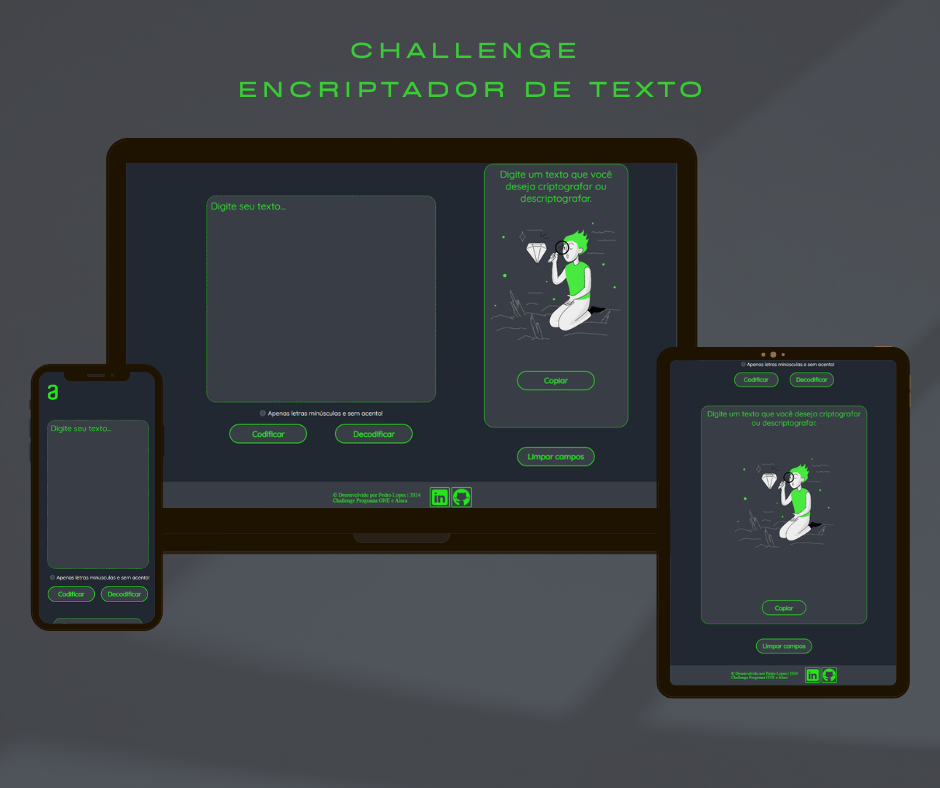
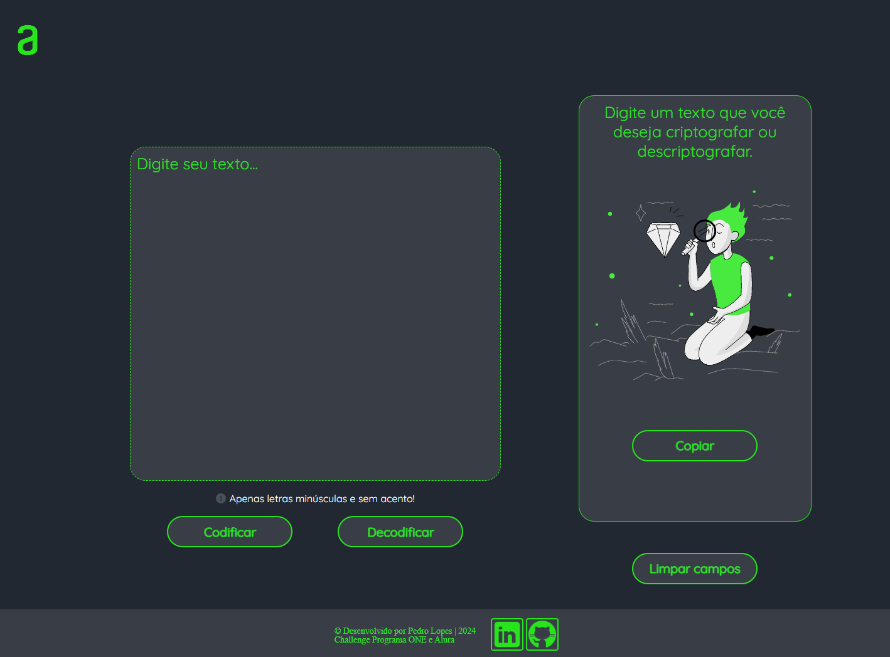
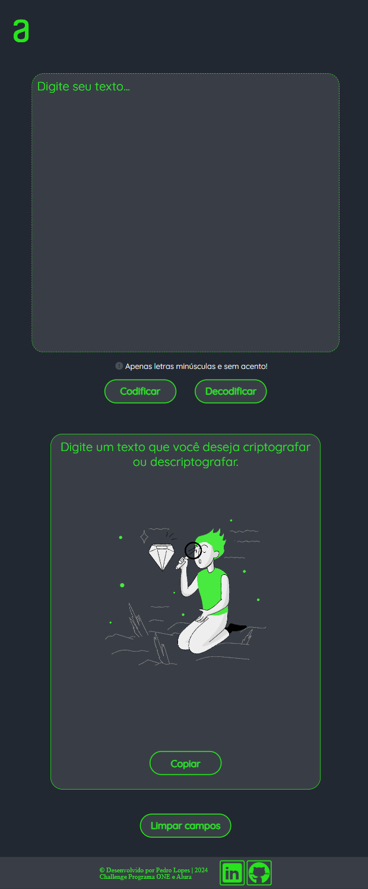
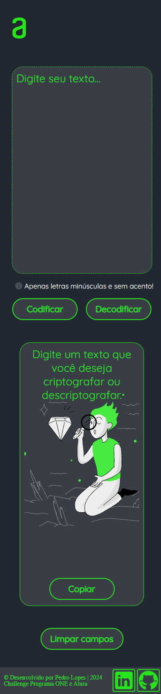

<h1 align="center">Alura Challenge | Encriptador de Texto | Oracle ONE</h1>

## 💻 Sobre o projeto:
Desafio Challenge Encriptador | Oracle ONE 2024 | Alura.
- Encriptador de texto feito em HTML5, CSS3 e JavaScript.
- O projeto teve como base um design do Figma, porém, com permissão criativa para customizar de acordo com as suas preferências e identidade visual. No meu caso, utilizei um tema escuro com detalhes na cor verde (imitando uma iluminação), oferecendo um layout interativo ao navegar pela página.

## 🎨 Screenshots:

Desktop:

Tablet:

Mobile:

## ✨ Funcionalidades:
- O Encriptador é um projeto web que permite a criptografia e descriptografia de textos utilizando um esquema básico de substituição de caracteres, conforme criptografia abaixo:
<ul>
  <li> A letra <code><strong>"e"</strong></code> se transforma em <code><strong>"enter"</strong></code></li>
  <li> A letra <code><strong>"i"</strong></code> vira <code><strong>"imes"</strong></code></li>
  <li> A letra <code><strong>"a"</strong></code> se converte em <code><strong>"ai"</strong></code></li>
  <li> A letra <code><strong>"o"</strong></code> muda para <code><strong>"ober"</strong></code></li>
  <li> A letra <code><strong>"u"</strong></code> se torna <code><strong>"ufat"</strong></code></li>
</ul>

<strong>Por exemplo:</strong>

<ul>
  <li><code>"gato"</code> se torna <code>"gaitober"</code></li>
  <li><code>"gaitober"</code> volta a ser <code>"gato"</code></li>
</ul>

- O usuário pode inserir um texto qualquer, que será transformado ao clicar nos botões de criptografar ou descriptografar e exibido na caixa de texto ao lado.

## 📋 Requisitos:
- Deve funcionar somente com letras minúsculas.
- Não devem ser utilizadas letras com acentos nem caracteres especiais.
- A página deve ter campos para inserção do texto a ser criptografado ou descriptografado, e a pessoa usuária deve poder escolher entre as duas opções.
- O resultado deve ser exibido na tela.
- Deve ser possível converter uma palavra para a versão criptografada e também retornar uma palavra criptografada para a versão original.

## 💡 Extras:
- Um botão que copie o texto criptografado/descriptografado para a área de transferência, ou seja, que tenha a mesma funcionalidade do ctrl+C ou da opção "copiar" do menu dos aplicativos.
- Adicionar responsividade ao projeto para diferentes tamanhos de tela.
- Aparecerá uma mensagem de aviso, quando os requisitos informados não forem satisfeitos (de que o texto poderá apenas conter letras minúsculas e sem acento). Neste momento não será permitido a codifcação do texto, enquanto não atender as regras, deixando a mensagem em vermelho para destaque.
- Aparecerá um alert na tela, quando o texto for copiado, informando o conteúdo que foi para a área de transferência.

## 🛠 Tecnologias Utilizadas:
- **HTML:** Para a estruturação semântica das páginas.
- **CSS:** Para estilização customizada e layout responsivo utilizando flexbox.
- **JavaScript:** Para implementação do decodificador de mensagens.

## ✅ Deploy
https://pedrollopesb.github.io/studying-alura-challenges-encriptador_de_texto/

https://studying-alura-challenges-encriptador-de-texto.vercel.app/

## ⭐ Badge Challenge Alura & Oracle ONE
---

## 🎨 Apresentação e funcionamento:

Desktop:

https://github.com/user-attachments/assets/45a41d28-3889-4c76-9d8b-a8e2bdf85361

https://github.com/user-attachments/assets/77490968-7cc5-4143-b962-48422ecb7b5d

Tablet:

https://github.com/user-attachments/assets/9b0d6444-bc16-412b-ba72-b8a0ca251b41

https://github.com/user-attachments/assets/6b4ef310-0e3d-4edf-8f7f-a3f45fb50036

Mobile:

https://github.com/user-attachments/assets/d49af9ea-defa-4401-bdbc-5d958b15791f

https://github.com/user-attachments/assets/34fdd140-d071-44c5-b107-bcb8964f7185

